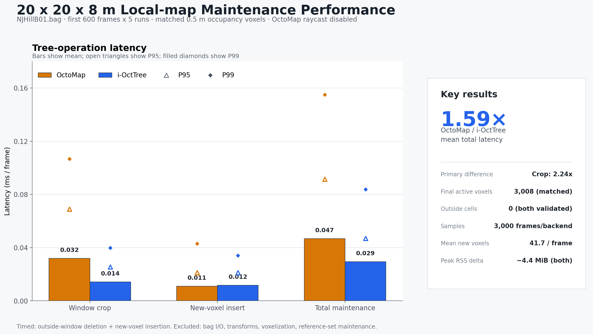

# Local-map maintenance benchmark

This benchmark compares i-OctTree and OctoMap while maintaining the same
moving spatial window on the `NJHillB01.bag` input used by the earlier map
update benchmark.

## Definition

- Window: 20 m × 20 m in XY, centered at the current LiDAR pose.
- Height: `[origin.z - 6 m, origin.z + 2 m]` (8 m total). This asymmetric
  interval retains the agricultural ground and vegetation below the UAV while
  avoiding mostly empty space above it.
- Input: valid LiDAR endpoints transformed into the world frame and filtered to
  the current window and 50 m range. A shared 0.5 m voxelization then supplies
  the exact same unique endpoint voxel centers to both trees each frame.
- Resolution: shared endpoint voxels and OctoMap resolution are 0.5 m;
  i-OctTree uses the project's paired minimum-extent setting of 0.25 m. The
  common voxel centers define map equivalence; the trees' internal node shapes
  are intentionally left native.
- A shared reference set tracks active voxel centers outside the timed region.
  Both backends receive only the exact same newly occupied centers, and the
  final stored-cell count must equal this reference set.
- i-OctTree: bucket size 32 and on-tree downsampling disabled so it preserves
  exactly one point for each active reference voxel.
- OctoMap: endpoint-only occupied updates with `lazy_eval=true`. No ray keys,
  miss updates, free-space representation, or inner occupancy propagation are
  computed.

Before inserting each frame, both trees delete the same six disjoint boxes
covering the space outside the current window. Tree/BBX pruning therefore avoids
a complete point scan while also handling sub-voxel window movement correctly.
OctoMap BBX candidates receive an exact leaf-center boundary check because its
floating bounds are quantized to keys. The timed region contains only deletion
and tree insertion. Bag I/O, PointCloud2 conversion, world-frame transformation,
and input filtering are excluded.

The program checks after the final frame that no stored point/leaf center lies
outside the final window and that both backends contain exactly the reference
active-voxel count. `map_elements` remains diagnostic because i-OctTree points
and OctoMap internal nodes have different meanings.

## Build and run

```bash
catkin_make -DCATKIN_ENABLE_TESTING=ON
./src/AgriLiRa4D_Mapping_iOctree/benchmark/run_local_map_maintenance.sh \
  /home/leaf/dataset/AgriLiRa4D/hill/NJHillB01.bag \
  /tmp/local-map-maintenance 2 600 5
```

Arguments after the output directory are CPU, frame count, and repetition
count. Each repetition runs each backend in a fresh process, and backend order
alternates to reduce thermal and allocator-order bias.

## Recorded result

The committed figure uses the first 600 frames of `NJHillB01.bag`, five fresh
processes per backend, and CPU core 2 (3,000 timed frames per backend).

| Mean latency | OctoMap | i-OctTree | OctoMap / i-OctTree |
|---|---:|---:|---:|
| Outside-window crop | 0.032 ms/frame | 0.014 ms/frame | 2.24x |
| New-voxel insert | 0.011 ms/frame | 0.012 ms/frame | 0.92x |
| Total maintenance | 0.047 ms/frame | 0.029 ms/frame | 1.59x |

Both backends ended with the same 3,008 active voxels and zero cells outside
the final window. The average input added 41.7 new voxels per frame, and the
observed peak RSS increase was approximately 4.4 MiB for both processes.



The result shows that i-OctTree's advantage in this workload comes primarily
from pruning the moving window. Endpoint insertion cost is effectively the same
at this scale. The comparison is intentionally endpoint-only: OctoMap ray
casting, miss updates, and inner occupancy propagation are disabled.
