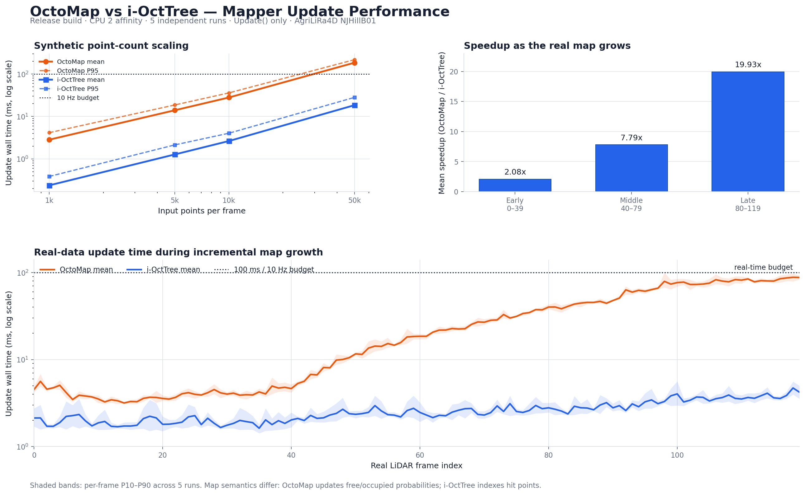

# OctoMap 与 i-OctTree `Update()` 定量实验报告

## 1. 结论先行

在本机、当前项目默认参数和 AgriLiRa4D 真实数据上，i-OctTree 的纯
`Update()` 明显更快：

| 测试 | OctoMap | i-OctTree | OctoMap / i-OctTree |
|---|---:|---:|---:|
| 核心基准，均值 | 29.919 ms | 2.573 ms | **11.63x** |
| 核心基准，P95 | 83.817 ms | 4.131 ms | **20.29x** |
| ROS链路，99帧配对均值 | 21.388 ms | 1.900 ms | **11.26x** |
| ROS链路，99帧配对P95 | 74.382 ms | 3.335 ms | **22.31x** |

这不是同语义的树结构对比。OctoMap 为每个测量点执行射线遍历，并更新
free/occupied 概率；i-OctTree 只维护命中点的增量点云索引。结论应理解为：
**在这个项目当前提供的两种地图功能之间切换，i-OctTree 的 Update 成本约低
一个数量级，但它不再提供 OctoMap 的空闲空间和占据概率。**

## 2. 实验环境与控制变量

- 机器：Intel Core Ultra 5 125H，18个逻辑CPU，WSL2 Linux。
- 构建：CMake `Release`。
- CPU：所有核心基准进程固定在逻辑CPU 2；每次重复均为新进程。
- 重复：每个场景5次，后端运行顺序逐轮交换。
- OctoMap：resolution 0.5 m，max range 50 m。
- i-OctTree：min extent 0.25 m，bucket size 32，downsample开启，max range 50 m。
- 计时器：`std::chrono::steady_clock`；只包围 `mapper->Update(input)`。
- 不计入：bag读取、PointCloud2反序列化、坐标变换、地图导出、ROS发布和RViz。

真实核心基准读取 `NJHillB01.bag` 的120帧LiDAR和
`/aircraft_pose_flu`。每帧平均34,612个有效输入点，其中99.0%位于50 m内。
两种后端共得到1,200个真实逐帧样本。加上合成规模测试，总计50个独立进程、
3,600个逐帧样本；1,800组后端配对输入全部一致。

## 3. 真实数据核心基准

| 后端 | 样本 | Mean | Median | P95 | P99 | Max | 平均每输入点 |
|---|---:|---:|---:|---:|---:|---:|---:|
| OctoMap | 600 | 29.919 ms | 18.864 ms | 83.817 ms | 93.516 ms | 115.895 ms | 877.7 ns |
| i-OctTree | 600 | 2.573 ms | 2.385 ms | 4.131 ms | 5.192 ms | 6.863 ms | 74.8 ns |

数据约为10 Hz，因此每帧的 Update 时间预算约100 ms：

- OctoMap：600帧中3帧超过100 ms，单看 Update 已经偶发追不上输入速率。
- i-OctTree：没有帧超过100 ms，P99只占预算的5.2%。
- OctoMap平均占29.9%的帧周期；i-OctTree平均占2.6%。这里尚未加入预处理、
  去畸变、坐标变换和发布成本。

### 地图增长阶段

| 阶段 | 帧号 | OctoMap mean / P95 | i-OctTree mean / P95 | 均值比 |
|---|---:|---:|---:|---:|
| 初期 | 0–39 | 4.001 / 5.117 ms | 1.920 / 3.265 ms | 2.08x |
| 中期 | 40–79 | 19.140 / 35.658 ms | 2.456 / 3.559 ms | 7.79x |
| 后期 | 80–119 | 66.617 / 91.581 ms | 3.342 / 4.667 ms | 19.93x |

最重要的现象不是初始速度，而是增长趋势：OctoMap在这段数据中随地图扩大
上升很快；i-OctTree也增长，但幅度温和得多。这解释了为什么只测前几帧会
严重低估OctoMap长期运行的成本。

## 4. 点数规模测试

每种点数运行60帧并重复5次，共300个样本：

| 点/帧 | OctoMap mean / P95 | i-OctTree mean / P95 | 均值比 |
|---:|---:|---:|---:|
| 1,000 | 2.842 / 4.162 ms | 0.239 / 0.387 ms | 11.91x |
| 5,000 | 14.030 / 18.716 ms | 1.277 / 2.144 ms | 10.98x |
| 10,000 | 28.033 / 35.980 ms | 2.644 / 4.037 ms | 10.60x |
| 50,000 | 185.167 / 218.281 ms | 18.482 / 28.197 ms | 10.02x |

50k点时OctoMap平均185 ms，已经无法满足10 Hz；i-OctTree平均18.5 ms，仍在
100 ms预算内。两者都不是严格线性：地图持续变大、树分裂、重复点比例和
内存缓存都会改变每点成本。

## 5. ROS端到端交叉验证

隔离ROS master上分别启动真实 `mapping_node`，关闭RViz，地图发布周期设为
1000 s，向两边回放相同15 s LiDAR和雷达话题。各采集100条
`/mapper_update_stats`。两次启动的第1条消息受订阅时机影响、点数不同，剔除；
剩余99条的LiDAR点数逐帧完全相同，平均23,634点。

| 后端 | Mean | Median | P95 | P99 | Max | >100 ms |
|---|---:|---:|---:|---:|---:|---:|
| OctoMap | 21.388 ms | 12.745 ms | 74.382 ms | 85.022 ms | 92.405 ms | 0/99 |
| i-OctTree | 1.900 ms | 2.245 ms | 3.335 ms | 5.695 ms | 6.500 ms | 0/99 |

ROS结果和核心基准的均值加速比非常接近（11.26x 对 11.63x）。ROS每次同步
窗口的点数少于完整LiDAR帧，所以绝对时间比完整帧核心基准更低。

## 6. CPU与RSS解释

两种 `Update()` 都由mapping工作线程单线程调用。核心基准的线程CPU/wall
均接近100%，说明大部分时间在一个逻辑CPU上进行计算，而不是并行使用多个
核心。进程固定到CPU 2只用于控制实验；正常 `roslaunch` 没有绑核，Linux可在
不同时间把这个线程迁移到不同核心，但同一时刻它仍只在一个核心上执行。

WSL2中 `CLOCK_THREAD_CPUTIME_ID` 与 `steady_clock` 的虚拟化时钟存在约1%级偏差，
短帧还会放大读取时钟的固定开销。因此部分线程CPU比率为101%–109%。这不是
线程同时用了1.09个核心；本报告的性能比较以steady-clock wall time为准。

核心真实场景的逐进程平均RSS增长：OctoMap约5.3 MiB，i-OctTree约6.0 MiB，
差异很小。合成50k唯一点压力场景中，OctoMap约11.1 MiB，i-OctTree约41.6
MiB，说明i-OctTree用更高的点存储成本换取速度。ROS短窗口中公共点云缓冲也
计入RSS，两边99帧增长分别约24.1和24.3 MiB，不能解释为纯地图内存。

## 7. 适用范围与限制

- 测的是当前实现，不是所有OctoMap或i-OctTree配置的普遍结论。
- 两种地图语义不同，不能根据速度直接断言i-OctTree“算法全面优于”OctoMap。
- 真实核心基准使用每帧最新姿态做刚体变换，没有把去畸变计入Update；ROS验证
  则经过项目原有同步与去畸变流程。
- RSS是进程常驻内存，不等于地图对象独占内存；长期全数据集内存峰值需要另做
  全程实验。
- i-OctTree上游 `size()` 是诊断计数，在叶节点降采样时可能包含随后被抑制的点；
  它不能和OctoMap节点数直接比较，因此结论不使用该计数。

原始逐帧CSV见 `raw/`，自动汇总见 `summary.md`，机器信息见
`environment.txt`，ROS交叉验证数据见 `ros_octomap.csv` 和
`ros_ioctree.csv`。
